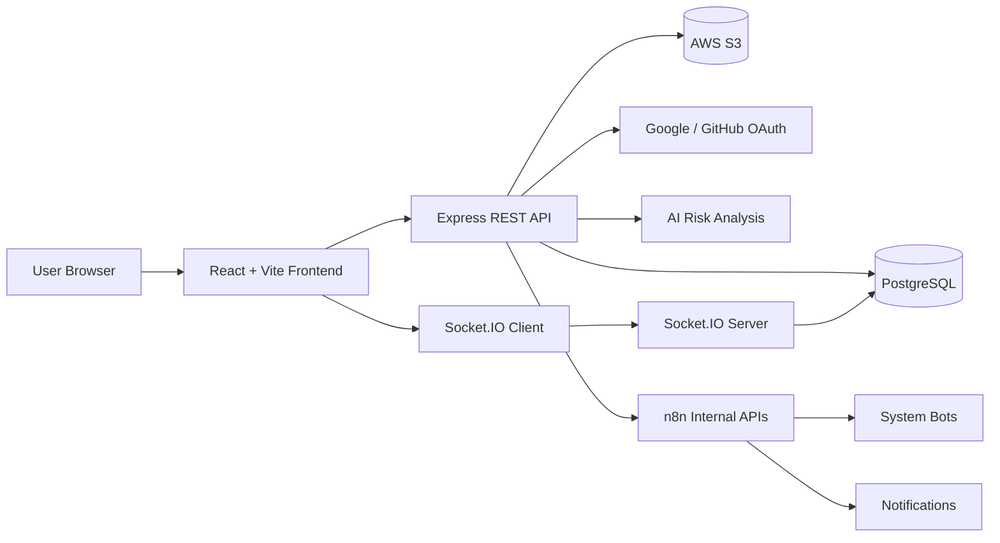

# Team Hub

Team Hub is a full-stack collaboration platform built as a course project for **New Technologies in Software Engineering**. The project explores how modern web technologies can be combined into a practical team workspace: real-time communication, project/task management, cloud file storage, OAuth authentication, PWA caching, automation hooks, and AI-assisted project risk analysis.

The application is designed around a simple idea: a team should be able to create a workspace, invite members, manage projects and tasks, communicate in channels, receive useful notifications, and monitor project health from one place.

## Course Context

This project was developed for the **New Technologies in Software Engineering** course. Instead of building only a CRUD application, Team Hub focuses on applying newer and industry-relevant techniques in a working full-stack system:

- Real-time collaboration with Socket.IO.
- Progressive Web App behavior with service worker runtime caching.
- OAuth-based authentication with Google and GitHub.
- Cloud-based file upload through AWS S3.
- AI-assisted risk analysis for project health monitoring.
- n8n-ready internal automation APIs for notifications and bot messages.
- Secure backend design with JWT, HttpOnly cookies, RBAC, Zod validation, Helmet, and CORS.

## Main Features

### 1. Authentication And User Accounts

- Register and log in with email/password.
- Sign in with Google OAuth 2.0 and GitHub OAuth.
- Store JWT in HttpOnly cookies to reduce token exposure in the browser.
- View and update user profile information.
- Upload avatar/profile images through the backend file upload pipeline.
- Link or unlink OAuth providers while ensuring the user always keeps at least one valid login method.

### 2. Team Workspaces

- Create teams as independent workspaces.
- Manage team members with role-based access:
  - `owner`
  - `admin`
  - `member`
- Invite users by email through secure invitation tokens.
- Preview, accept, or decline invitations.
- Emit real-time events when invitations are created or when members join a team.
- Prevent duplicate memberships and duplicate pending invitations at the database level.

### 3. Project Management

- Create projects inside a team.
- Add team members into specific projects.
- Manage project-level roles:
  - `lead`
  - `editor`
  - `viewer`
- Control access based on both team membership and project membership.
- Protect important project actions so only valid roles can create, edit, delete, or manage members.

### 4. Task Management

- Create and manage tasks inside projects.
- Track task status:
  - `todo`
  - `in_progress`
  - `review`
  - `done`
- Set task priority:
  - `low`
  - `medium`
  - `high`
  - `urgent`
- Assign multiple users to the same task through a many-to-many task assignment table.
- View personal tasks across projects in a dedicated "My Tasks" page.
- Group tasks by due date, including overdue, today, upcoming, and no-date tasks.

### 5. Real-Time Chat

- Create team channels and project-specific channels.
- Send real-time messages through Socket.IO.
- Join channel rooms so users receive updates only for relevant conversations.
- Support a REST fallback endpoint for message delivery.
- Upload up to **5 files per request**, with a **100MB per-file limit**.
- Store file attachments in AWS S3 using unique object keys.
- Filter uploaded files by MIME type, including images, documents, archives, code files, video, and audio.
- Soft-delete messages by replacing removed content instead of destroying the message record.
- Store shared-link metadata for richer channel context.

### 6. Notifications

- Provide an in-app notification center.
- Store notification history in PostgreSQL.
- Track read/unread status.
- Support unread-count queries.
- Mark selected notifications or all notifications as read.
- Send real-time notification events through personal Socket.IO rooms such as `user:{id}`.
- Keep notification queries efficient with indexes on user, unread state, and creation time.

### 7. PWA Runtime Caching

The frontend uses `vite-plugin-pwa` and Workbox runtime caching to make the app feel faster and more resilient:

- Cache up to **100 API responses** for **24 hours** using a Network First strategy.
- Cache up to **60 static assets** for **30 days**.
- Cache up to **10 Google Fonts entries** for **1 year**.
- Automatically clean outdated caches.
- Activate new service workers quickly with `skipWaiting` and `clientsClaim`.

### 8. AI-Assisted Project Risk Analysis

Team Hub includes a risk-report module for project health monitoring. The system collects project context and produces risk reports containing:

- Risk score from **0 to 100**.
- Risk level:
  - `Low`
  - `Medium`
  - `High`
  - `Critical`
- Human-readable summary.
- Detailed risk factors.
- Suggested actions.
- Raw analysis context for debugging or audit purposes.
- Historical risk reports and trend queries.

The goal is to help a team detect common project issues earlier, such as overdue tasks, workload imbalance, slow progress, or deadline risk.

### 9. n8n And Bot Automation APIs

The backend exposes internal APIs intended for automation workflows such as n8n. These endpoints are protected separately from user-facing routes:

- System-key authentication through request headers.
- Internal API rate limiting.
- Strict Zod validation.
- Single-user notifications.
- Batch notifications capped at **100 notifications per request**.
- Bot messages into specific channels.
- Team announcements through bot users.
- Deadline reminder workflows.
- Project and team health data endpoints.

The database also includes virtual bot users such as:

- `system-bot`
- `reminder-bot`
- `onboarding-bot`
- `health-bot`

### 10. Admin Portal And Audit Logs

- Admin-only dashboard and user management pages.
- System roles:
  - `user`
  - `admin`
- Admin role changes and user deletion flows.
- Audit logs for admin actions, including target user, previous value, new value, IP address, and timestamp.
- Live database role checks for admin routes instead of trusting only the JWT claim, reducing the risk of stale 7-day role claims after a user is demoted.

## Technology Stack

### Frontend

- React 19
- Vite
- React Router
- React Query
- Tailwind CSS
- Socket.IO Client
- Zod
- vite-plugin-pwa
- Lucide React

### Backend

- Node.js
- Express 5
- PostgreSQL
- `postgres` SQL client
- Socket.IO
- Passport.js
- Google OAuth 2.0
- GitHub OAuth
- JWT
- Cookie Parser
- Helmet
- CORS
- Zod
- AWS SDK for S3
- Multer + multer-s3

### Database

The database is modeled around collaborative workspaces:

- `users`
- `teams`
- `team_members`
- `projects`
- `project_members`
- `tasks`
- `task_assignees`
- `channels`
- `messages`
- `team_invitations`
- `project_risk_reports`
- `notifications`
- `bot_users`
- `message_links`
- `admin_audit_logs`

## High-Level Architecture



## Repository Structure

```text
Team Hub/
+-- backend/
|   +-- db/
|   |   +-- schema.sql
|   +-- src/
|   |   +-- config/
|   |   +-- controllers/
|   |   +-- middlewares/
|   |   +-- models/
|   |   +-- routes/
|   |   +-- services/
|   |   +-- socket/
|   |   +-- utils/
|   |   +-- app.js
|   |   +-- index.js
|   +-- package.json
+-- frontend/
|   +-- public/
|   +-- src/
|   |   +-- components/
|   |   +-- hooks/
|   |   +-- services/
|   |   +-- main.jsx
|   +-- vite.config.js
|   +-- package.json
+-- README.md
```

## What This Project Demonstrates

Team Hub demonstrates a practical full-stack workflow with modern JavaScript technologies:

- Building a React SPA with route-based pages and reusable components.
- Designing REST APIs for real business entities such as teams, projects, tasks, messages, and notifications.
- Modeling relational data for many-to-many relationships and role-based access.
- Combining HTTP APIs with real-time WebSocket communication.
- Handling authentication and authorization beyond a simple login screen.
- Integrating cloud file storage into a collaboration workflow.
- Adding service worker caching for a PWA-style user experience.
- Designing internal APIs for automation agents and scheduled workflows.
- Applying AI to support project management decisions.

## Project Status

This is an academic/personal project built to explore new software engineering technologies. It is not a commercial product, but the architecture and feature set are designed to be close to a real collaboration platform.
